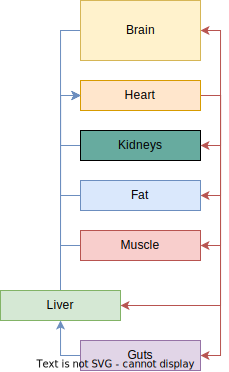

## Glucose metabolism simulator

Glucose is quite essential to many organs in the body. It gets oxidized, converted to different molecules, reassembled, all in coordination among different tissues. The purpose of this model is to let you appreciate the connectivity and flexibility of the glucose system. The model connects tissues with bloodflow this way:

### **What does the body do when glucose is high**

In glucose tolerant tissues, the whole organism can adapt quickly to changes in the availability of glucose. In the bottom graph you can see what happens after injecting glucose to the vein. Set up how many grams of glucose will get injected and play the simulation. Before a new dose, reset and pause the simulation.

<bdl-fmi id="fmi1" mode="continuous" src="GlucoseMetabolism_WholyBodyAlt.js" fminame="GlucoseMetabolism_WholyBodyAlt" tolerance="0.001" starttime="0" fstepsize="10" guid="{0de8e515-f2d6-4555-a73a-3e1b90234ee4}" valuereferences="905971310,905971311,905971309,905971225,905971281,905971292,905971307,905971259,905971271,905971213,905971212,905971257,905971256" valuelabels="venous_glu,venous_ins,glucagon_C,liver_glu_out,brain_glu_out,gut_glu_out,lungs_glu_in,muscle_glu_out,adipose_glu_out,liver_gly_to_g6p,liver_g6p_to_gly,muscle_gly_to_g6p,muscle_g6p_to_gly"  inputs="id1,16777464,1,70,t" inputlabels="glu_dose"></bdl-fmi>

<bdl-range id="id1" title="glucose dose [g]" min="0" max="70" default="35" step="5"></bdl-range>

On the left, you can see how venous glucose concentration (shown in mg/dl) quickly rises and then slowly decays. The goal of the metabolism is to return to normal levels. This is made possible by changes in glucagon and insulin concentrations which can be seen on the right (units are chosen to allow comparison). The pancreas first releases insulin quickly and then follows up with a second wave. Glucagon reacts by declining a bit to help enhance the insulin response.

<bdl-chartjs-time width="300" height="200" fromid="fmi1" labels="Venous glucose [mg/dl] " initialdata="" refindex="0" refvalues="1" xlabel = 'time [s]' min = 40 max = 600 
maxdata = 256>
</bdl-chartjs-time><bdl-chartjs-time width="300" height="200" fromid="fmi1" labels="Insulin,Glucagon" initialdata="" refindex="1" refvalues="2"
convertors="1,1.3;1,60"
min = 0 max = 7>
</bdl-chartjs-time>

Some organs are sensitive to changes in glucose concentrations and their uptake of glucose can be altered by hormones. The most two important tissues which have to be affected to deal with the glucose infusion are the liver and skeletal muscle. You can see their uptake (release if negative) in mg/min on the left side. The liver quickly stops producing glucose and intakes the first portion. The muscle gradually increases its uptake and takes in the rest. On the right side you can see the glucose uptake for other tissues.

<bdl-chartjs-time width="300" height="200" fromid="fmi1" labels="liver, muscle" initialdata="" refindex="3,7" refvalues="2"></bdl-chartjs-time><bdl-chartjs-time 
width="300" height="200" fromid="fmi1" labels="brain, gut, lungs, adipose" initialdata="" refindex="4,5,6,8" refvalues="4"></bdl-chartjs-time>

As you saw in the graphs before, the liver and the muscle are the most important to deal with the glucose. This is made possible mainly by changing glycogen breakdown and glycogen synthesis. In other words, less glucose gets produced and more glucose gets stored. You can watch the processes in the liver (left) and the muscle (right) in the graphs below. Both flows are shown in mg/min.

<bdl-chartjs-time width="300" height="200" fromid="fmi1" labels="breakdown, synthesis" initialdata="" refindex="9,10" refvalues="2"></bdl-chartjs-time><bdl-chartjs-time width="300" height="200" fromid="fmi1" labels="breakdown, synthesis" initialdata="" refindex="11,12" refvalues="2"></bdl-chartjs-time>

